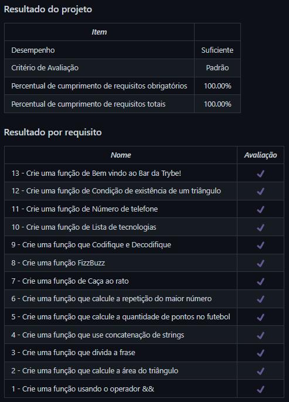

# Playground Functions
Projeto da [Trybe](https://www.betrybe.com/) - Bloco 4 - Construção de funções em JavaScript com estruturas condicionais e de repetição.

## 💻 Projeto

Implementação de funções em JavaScript com estruturas condicionais e de repetição e outras features do JavaScript.

  
<strong>🏆 Meu desempenho</strong>
 

  

## 🚀 Tecnologias
> Este projeto foi desenvolvido com as seguintes tecnologias:

- JavaScript

## 📌 Habilidades
> Neste projeto, desenvolvi as seguintes habilidades:

- Escrever códigos em JavaScript que usam variáveis e tipos primitivos;
- Utilizar conceitos da linguagem como a tipagem dinâmica e operadores lógicos/aritméticos/de atribuição;
- Criar códigos que usam estruturas condicionais, como o `if/else` e o `switch/case`;
- Manipular arrays e objetos;
- Utilizar os comando `for`, `for/in` e `for/of`;
- Utilizar a lógica de programação na resolução de problemas;
- Utilizar funções para organizar e estruturar o código.

## 💬 Contatos

   
   
  

<!-- ## 📄 Licença

Esse projeto está sob licença. Veja o arquivo [LICENÇA](LICENSE.md) para mais detalhes.

[⬆ Voltar ao topo](#nome-do-projeto)  -->
